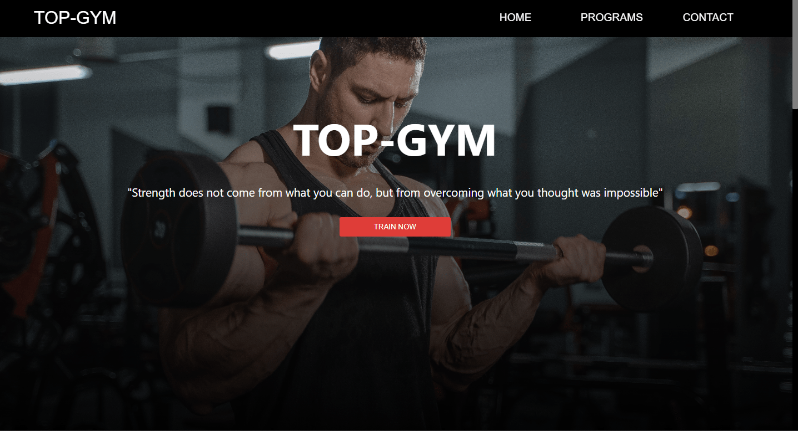
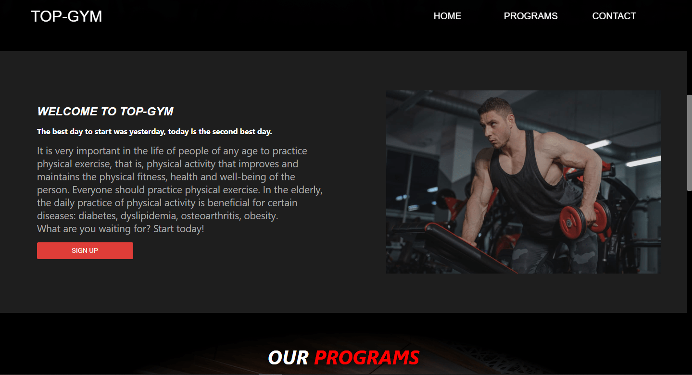
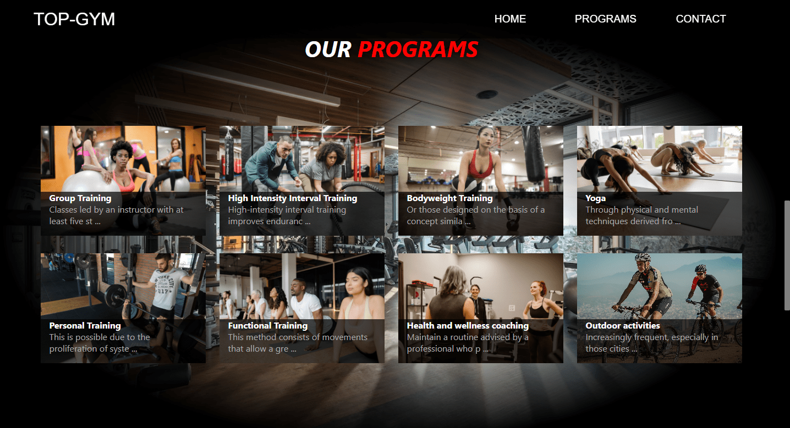
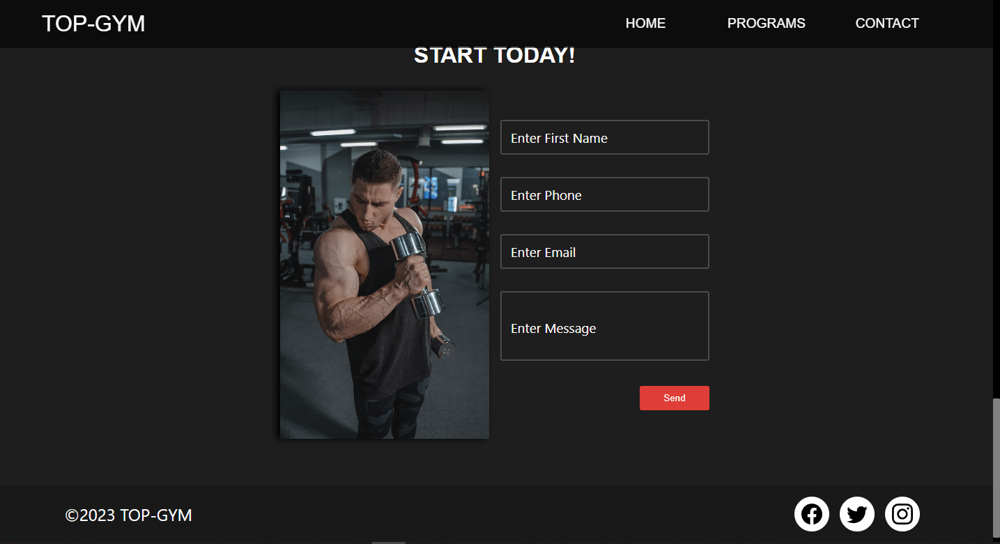

## Table of Contents
1. [General Info](#general-info)
2. [Technologies](#technologies)
3. [Installation](#installation)
3. [Screenshots](#Screenshots)
4. [Deploy](https://projects-ribes.netlify.app/)

### General Info
***

The application is a SPA (single page application) created with React v18.2.0, the app is focused for a gym to show their training programs and at the same time that the user can register by email.

La aplicación es una SPA (aplicación de una sola página) creada con React v18.2.0, la app esta enfocada para un gimnasio para mostrar sus programas de entrenamiento y a la vez que el usuario se pueda inscribir mediante un correo.

## Technologies
***
A list of technologies used within the project:
* React: Version 18.2.0

## Installation
***
A little intro about the installation. 
```
$ git clone https://github.com/rodri-ribes/top-gym.git

./client
    $ npm install
    $ npm start
```
### Screenshots
***

***

***

***

***
